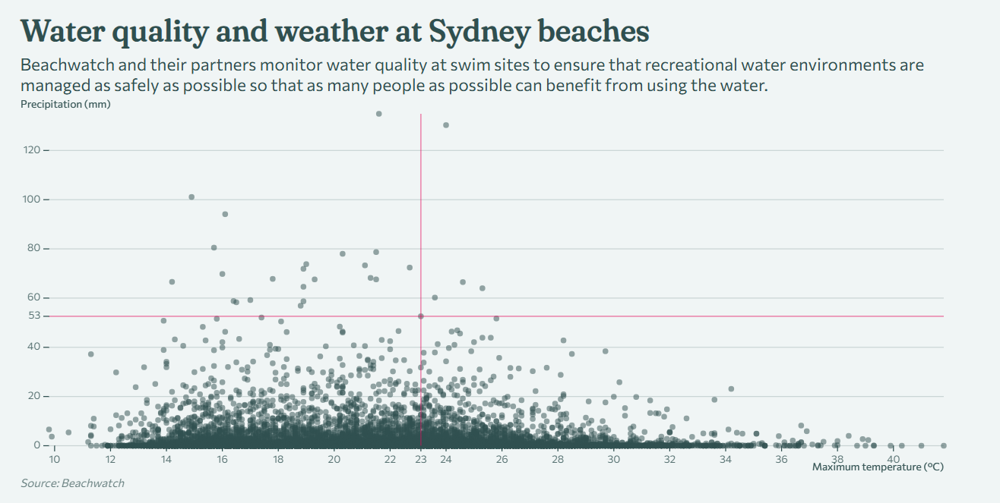

# SveltePlotPlayground

This is a space to experiment with [SveltePlot](https://svelteplot.dev/).

## Developing

To start a development server:

```bash
npm run dev -- --open
```

## Building

To create a production version of the app:

```bash
npm run build
```

You can preview the production build with `npm run preview`.

## Examples

